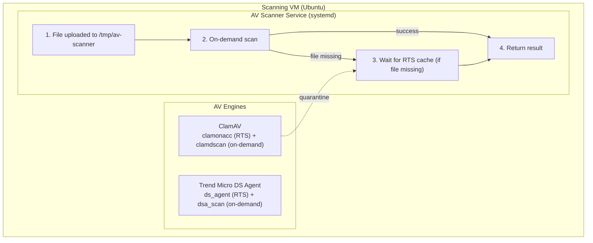
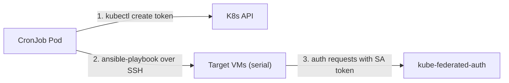

# AV Scanner - Antivirus Abstraction Layer

A unified antivirus scanning service that supports multiple AV engines (ClamAV and Trend Micro DS Agent) running on a **dedicated VM** with a consistent API.

## Architecture

Both ClamAV and Trend Micro DS Agent run on a **dedicated Ubuntu VM**. The scanner uses a **hybrid approach** combining real-time scanning (RTS) and on-demand scanning for reliability:

| Component | ClamAV | Trend Micro DS Agent |
|-----------|--------|----------------------|
| **RTS Log** | `/var/log/clamav/clamonacc.log` | `/var/log/ds_agent/ds_agent.log` |
| **On-demand Binary** | `clamdscan` | `dsa_scan` |



## Scan Flow

1. **File uploaded** to scan directory
2. **On-demand scan** - run `clamdscan`/`dsa_scan`
   - If scan completes successfully, use its result (clean/infected)
3. **RTS fallback** - if on-demand scan fails (file missing = RTS quarantined it):
   - Wait for RTS cache with configurable timeout (default: 500ms + 10ms per MB)
   - Return infected if found in cache, error if timeout

This hybrid approach ensures:
- **Fast detection** (~200ms avg) for most files via on-demand scan
- **Reliable detection** even when RTS quarantines files before on-demand scan runs
- **No false negatives** from race conditions

## Features

- **Hybrid scanning**: Combines RTS (fast) and on-demand (reliable) scanning
- **Unified interface**: Both engines use the same Driver interface
- **Isolated VM**: AV engines run in a dedicated Ubuntu VM
- **Race condition handling**: Checks RTS cache before and after on-demand scan
- **Ephemeral file handling**: Files are deleted immediately after scanning
- **Native systemd integration**: Runs as a native binary via systemd
- **SA token authentication**: Kubernetes ServiceAccount token auth via [kube-federated-auth](https://github.com/rophy/kube-federated-auth)
- **CronJob deployer**: Automated deployment via K8s CronJob that mints fresh SA tokens

## Deployment

av-scanner is deployed to a VM using an Ansible playbook. There are two deployment methods:

### Local development (make deploy)

Build the Go binary locally and deploy directly to a VM via Ansible:

```bash
# 1. Create a VM
make vm-init

# 2. Build binary and deploy
make deploy
```

`make deploy` will:
1. Cross-compile the Go binary for linux/amd64
2. Run the Ansible playbook (`ansible/playbooks/deploy.yaml`) which:
   - Installs ClamAV and configures real-time scanning
   - Copies the binary to `/usr/local/bin/av-scanner`
   - Creates and starts a systemd service
   - Waits for the health check to pass

### Production (Helm chart)

In production, a **K8s CronJob** runs every 12 hours to deploy av-scanner to VMs (rolling, one at a time) and refresh SA tokens:



The deployer image (`docker/Dockerfile`) bundles the Go binary, Ansible, and kubectl. The entrypoint (`docker/entrypoint.sh`):
1. Mints a fresh SA token via `kubectl create token` (default: 24h expiry)
2. Runs the Ansible playbook to deploy the binary and token to VMs (one at a time)

The CronJob schedule (every 12h) must be shorter than `TOKEN_DURATION` (24h) to ensure the token is refreshed before it expires.

To deploy:

```bash
# Build the deployer image
make build-deploy

# Install the Helm chart
helm install av-scanner charts/av-scanner -n av-scanner --create-namespace
```

See `charts/av-scanner/values.yaml` for all configurable values.

## VM Management

VMs are managed via libvirt/virsh. Each VM gets a real IP on the default NAT network. No state files — virsh is the source of truth.

```bash
# Create VM (default: 1 VM named "av-scanner")
./scripts/vm-init.sh

# Create multiple VMs
./scripts/vm-init.sh --name molecule --count 2

# Start/stop/destroy
make vm-start
make vm-stop
make vm-destroy
```

## Makefile Targets

| Target | Description |
|--------|-------------|
| `make vm-init` | Create VM via libvirt/virsh |
| `make vm-start` | Start existing VM |
| `make vm-stop` | Graceful shutdown |
| `make vm-destroy` | Destroy VM and remove disk |
| `make build` | Build the binary-only container image |
| `make build-deploy` | Build the deployer image (binary + ansible + kubectl) |
| `make deploy` | Build binary locally and deploy to VM via ansible |
| `make test-unit` | Run unit tests |
| `make test-helm` | Run Helm chart lint and unit tests |
| `make test-molecule` | Run Molecule tests |
| `make test-e2e` | Run e2e tests (BATS) |
| `make test-perf` | Run k6 load tests |
| `make clean` | Remove local images |

## Configuration

| Variable | Default | Description |
|----------|---------|-------------|
| `PORT` | 3000 | HTTP server port |
| `AV_ENGINE` | clamav | Active engine (clamav/trendmicro) |
| `UPLOAD_DIR` | /tmp/av-scanner | Shared scan directory |
| `MAX_FILE_SIZE` | 104857600 | Max upload size in bytes (100MB) |
| `LOG_LEVEL` | info | Log level |
| `CLAMAV_RTS_LOG_PATH` | /var/log/clamav/clamonacc.log | ClamAV RTS log file |
| `CLAMAV_SCAN_BINARY` | /usr/bin/clamdscan | ClamAV on-demand scan binary |
| `CLAMAV_TIMEOUT` | 15000 | ClamAV scan timeout in ms |
| `CLAMAV_RTS_CACHE_BASE_DELAY` | 500 | Base delay (ms) when waiting for RTS cache |
| `CLAMAV_RTS_CACHE_DELAY_PER_MB` | 10 | Additional delay (ms) per MB of file size |
| `TM_RTS_LOG_PATH` | /var/log/ds_agent/ds_agent.log | DS Agent RTS log file |
| `TM_SCAN_BINARY` | /opt/ds_agent/dsa_scan | DS Agent on-demand scan binary |
| `TM_TIMEOUT` | 15000 | DS Agent scan timeout in ms |
| `TM_RTS_CACHE_BASE_DELAY` | 500 | Base delay (ms) when waiting for RTS cache |
| `TM_RTS_CACHE_DELAY_PER_MB` | 10 | Additional delay (ms) per MB of file size |

### Authentication Configuration

| Variable | Default | Description |
|----------|---------|-------------|
| `AUTH_ENABLED` | false | Enable K8s ServiceAccount authentication |
| `K8S_API_ENDPOINT` | (required if enabled) | URL of kube-federated-auth service |
| `K8S_AUTH_TIMEOUT` | 5000 | Auth service timeout in ms |
| `AUTH_ALLOWLIST_FILE` | /etc/av-scanner/allowlist.yaml | Path to ServiceAccount allowlist |
| `K8S_AUTH_TOKEN_PATH` | (optional) | Path to SA token file for authenticating to kube-federated-auth |

### Deployer CronJob Configuration

These env vars are set on the deployer CronJob container (see `charts/av-scanner/values.yaml`):

| Variable | Default | Description |
|----------|---------|-------------|
| `SA_NAME` | av-scanner | ServiceAccount to mint tokens for |
| `SA_NAMESPACE` | av-scanner | Namespace of the ServiceAccount |
| `TOKEN_DURATION` | 24h | Token expiry (must be longer than CronJob schedule) |
| `INVENTORY_PATH` | inventory.yaml | Path to Ansible inventory file |

## Authentication

av-scanner supports authentication using Kubernetes ServiceAccount tokens via [kube-federated-auth](https://github.com/rophy/kube-federated-auth).

### How it works

1. Client sends request with `Authorization: Bearer <k8s-sa-token>` header
2. av-scanner forwards the token to kube-federated-auth's TokenReview API
3. If `K8S_AUTH_TOKEN_PATH` is set, av-scanner authenticates itself to kube-federated-auth using its own SA token
4. av-scanner checks if the client's ServiceAccount is in the allowlist
5. Request proceeds if authorized, otherwise returns 401/403

### Allowlist file format

```yaml
# /etc/av-scanner/allowlist.yaml
allowlist:
  - namespace/serviceaccount
  - ci-cd/pipeline-runner
```

The file is watched for changes and reloaded automatically (hot-reload).

### Endpoints that skip authentication

- `GET /api/v1/live` - Kubernetes liveness probe
- `GET /api/v1/ready` - Kubernetes readiness probe
- `GET /metrics` - Prometheus metrics

### Error responses

| Status | Scenario |
|--------|----------|
| 401 | Missing or invalid Authorization header |
| 401 | Token validation failed (expired, invalid signature) |
| 403 | ServiceAccount not in allowlist |

## Service Management

The scanner runs as a systemd service on the target VM:

```bash
# Check service status
sudo systemctl status av-scanner

# View logs
sudo journalctl -u av-scanner -f

# Restart service
sudo systemctl restart av-scanner
```

## API

### POST /api/v1/scan
Upload and scan a file.

```bash
curl -X POST -F "file=@testfile.txt" http://<VM_IP>:3000/api/v1/scan
```

**Response (clean file):**
```json
{
  "fileId": "550e8400-e29b-41d4-a716-446655440000",
  "fileName": "testfile.txt",
  "status": "clean",
  "engine": "clamav",
  "duration": 65
}
```

**Response (infected file):**
```json
{
  "fileId": "550e8400-e29b-41d4-a716-446655440000",
  "fileName": "eicar.com",
  "status": "infected",
  "engine": "clamav",
  "signature": "Win.Test.EICAR_HDB-1",
  "duration": 51
}
```

### GET /api/v1/health
Health check for all engines.

### GET /api/v1/engines
List available engines.

### GET /api/v1/ready
Readiness probe (checks active engine health).

### GET /api/v1/live
Liveness probe.

## Testing

### Unit tests

```bash
make test-unit
```

### E2E tests

E2E tests use [BATS](https://github.com/bats-core/bats-core) with a libvirt VM + kind cluster to test the full deployment path (K8s Job as ansible controller):

```bash
# Create e2e VM first
./scripts/vm-init.sh --name av-scanner-e2e

# Run all e2e tests
make test-e2e

# Run individually
bats test/e2e/01_e2e.bats
```

### Stress testing with k6

```bash
# Default: 10 VUs for 30 seconds
make test-perf

# Custom API URL and load
k6 run -e API_URL=http://<VM_IP>:3000 k6-stress-test.js
k6 run --vus 50 --duration 60s k6-stress-test.js
```

The stress test sends 80% clean / 20% infected (EICAR) files and verifies 100% correct scan results.

## License

MIT
