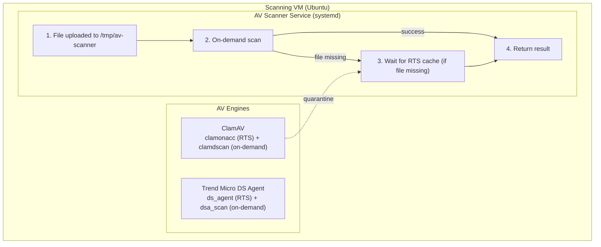

# AV Scanner

A unified antivirus scanning service that abstracts multiple AV engines behind a consistent HTTP API, running on dedicated Ubuntu VMs.

## Architecture

| Component | ClamAV | Trend Micro DS Agent |
|-----------|--------|----------------------|
| **RTS Log** | `/var/log/clamav/clamonacc.log` | `/var/log/ds_agent/ds_agent.log` |
| **On-demand Binary** | `clamdscan` | `dsa_scan` |

## Scan Flow

1. **File uploaded** to scan directory
2. **On-demand scan** — run `clamdscan` / `dsa_scan`
   - If scan completes, use its result (clean / infected)
3. **RTS fallback** — if on-demand scan fails (file missing = RTS quarantined it):
   - Wait for RTS cache with configurable timeout (default: 500ms + 10ms per MB)
   - Return infected if found in cache, error if timeout

This hybrid approach ensures:
- **Fast detection** (~200ms avg) for most files via on-demand scan
- **Reliable detection** even when RTS quarantines files before on-demand scan runs
- **No false negatives** from race conditions between RTS and on-demand

## Documentation

| Document | Audience | Description |
|----------|----------|-------------|
| [API Reference](docs/api.md) | Consumers | Endpoints, authentication, error codes |
| [Deployment Guide](docs/deployment.md) | Operators | Helm chart, playbooks, configuration |
| [Development Guide](docs/development.md) | Contributors | Local setup, building, testing |

## License

MIT
