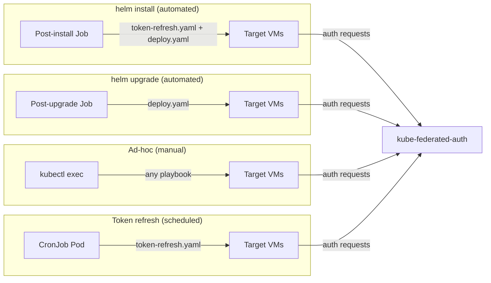

# Deployment Guide

## Overview

av-scanner runs as a systemd service on Ubuntu VMs. The Helm chart provides three mechanisms for managing deployments:

1. **Helm hooks** — automated Jobs that run on `helm install` and `helm upgrade` to deploy av-scanner to VMs without manual intervention.
2. **Controller pod** — an always-on pod for ad-hoc operations (re-deploy, troubleshooting, running playbooks manually).
3. **CronJob** — runs on a schedule (default: every 12h) to refresh SA tokens on VMs.



## Helm Chart

### Prerequisites

Create a Kubernetes secret containing the SSH private key for connecting to target VMs. The secret must have a key named `id_ed25519`:

```bash
kubectl create ns av-scanner
kubectl -n av-scanner create secret generic my-ssh-key --from-file=id_ed25519=<path>
```

### Install

```bash
helm install av-scanner oci://ghcr.io/null-ptr-exception/av-scanner/charts/av-scanner \
    -n av-scanner \
    --set sshKey.existingSecret=my-ssh-key
```

`sshKey.existingSecret` is required — the chart will fail to render without it.

See `charts/av-scanner/values.yaml` for all configurable values.

### What happens on install

1. **Pre-install hook** — validates SSH connectivity to all inventory hosts (`ansible all -m ping`)
2. **Post-install hook** — mints a fresh SA token, then runs the full deploy playbook

### What happens on upgrade

1. **Post-upgrade hook** — runs the deploy playbook (no new token minted; existing tokens are preserved)

## Controller Pod

The controller pod is an always-on Deployment for initial setup and ad-hoc operations. It is enabled by default (`controller.enabled: true`).

```bash
# Exec into the controller
kubectl -n av-scanner exec -it deploy/av-scanner-controller -- bash

# Full deploy (ClamAV + binary + config)
ansible-playbook playbooks/deploy.yaml

# Refresh tokens only
ansible-playbook playbooks/token-refresh.yaml

# Restart av-scanner on all VMs
ansible-playbook playbooks/restart.yaml
```

## Playbooks

| Playbook | Description |
|----------|-------------|
| `playbooks/deploy.yaml` | Full deploy: ClamAV + av-scanner binary + config |
| `playbooks/token-refresh.yaml` | Mint SA token + copy to VMs + rolling restart |
| `playbooks/restart.yaml` | Rolling restart of av-scanner service |

All playbooks run with `serial: 1` (one VM at a time) and wait for the health check to pass before proceeding to the next VM, ensuring zero-downtime when a load balancer is in front.

## CronJob

The CronJob runs `token-refresh.yaml` on a schedule (default: every 12h) to mint fresh SA tokens and distribute them to VMs.

The CronJob schedule must be shorter than `TOKEN_DURATION` (default: 168h) to ensure tokens are refreshed before expiry. With the default settings, up to 14 consecutive missed runs can be tolerated before tokens expire.

## Load balancing with Istio

The Helm chart can optionally create Istio resources (ServiceEntry, WorkloadEntry, VirtualService, DestinationRule) to load-balance traffic across VMs through an existing Istio ingress gateway.

```yaml
istio:
  enabled: true
  gatewayRef: istio-system/av-scanner   # cross-namespace Gateway reference
  serviceHost: av-scanner.corp.localhost
  workloadEntries:
  - name: vm1
    address: 192.168.122.178
  - name: vm2
    address: 192.168.122.45
```

The Gateway resource itself must be deployed separately in the ingress gateway namespace. See [Load Balancing with Istio Gateway](load-balancing-with-istio.md) for the full design, resource placement, and traffic flow.

## Configuration

### av-scanner service

Environment variables set on the VM (via Ansible role defaults or systemd override):

| Variable | Default | Description |
|----------|---------|-------------|
| `PORT` | 3000 | HTTP server port |
| `AV_ENGINE` | clamav | Active engine (`clamav` / `trendmicro`) |
| `UPLOAD_DIR` | /tmp/av-scanner | Shared scan directory |
| `MAX_FILE_SIZE` | 104857600 | Max upload size in bytes (100MB) |
| `LOG_LEVEL` | info | Log level |

#### ClamAV engine

| Variable | Default | Description |
|----------|---------|-------------|
| `CLAMAV_RTS_LOG_PATH` | /var/log/clamav/clamonacc.log | RTS log file |
| `CLAMAV_SCAN_BINARY` | /usr/bin/clamdscan | On-demand scan binary |
| `CLAMAV_TIMEOUT` | 15000 | Scan timeout (ms) |
| `CLAMAV_RTS_CACHE_BASE_DELAY` | 500 | Base delay for RTS cache (ms) |
| `CLAMAV_RTS_CACHE_DELAY_PER_MB` | 10 | Additional delay per MB (ms) |

#### Trend Micro DS Agent engine

| Variable | Default | Description |
|----------|---------|-------------|
| `TM_RTS_LOG_PATH` | /var/log/ds_agent/ds_agent.log | RTS log file |
| `TM_SCAN_BINARY` | /opt/ds_agent/dsa_scan | On-demand scan binary |
| `TM_TIMEOUT` | 15000 | Scan timeout (ms) |
| `TM_RTS_CACHE_BASE_DELAY` | 500 | Base delay for RTS cache (ms) |
| `TM_RTS_CACHE_DELAY_PER_MB` | 10 | Additional delay per MB (ms) |

### Authentication

| Variable | Default | Description |
|----------|---------|-------------|
| `AUTH_ENABLED` | false | Enable SA token authentication |
| `K8S_API_ENDPOINT` | (required if enabled) | URL of kube-federated-auth service |
| `K8S_AUTH_TIMEOUT` | 5000 | Auth service timeout (ms) |
| `AUTH_ALLOWLIST_FILE` | /etc/av-scanner/allowlist.yaml | Path to SA allowlist |
| `K8S_AUTH_TOKEN_PATH` | (optional) | SA token for authenticating to kube-federated-auth |

### Deployer (CronJob / controller pod)

These env vars are read by the playbooks via `lookup('env', ...)`:

| Variable | Default | Description |
|----------|---------|-------------|
| `SA_NAME` | av-scanner | ServiceAccount to mint tokens for |
| `SA_NAMESPACE` | av-scanner | Namespace of the ServiceAccount |
| `TOKEN_DURATION` | 168h | Token expiry |

## Service management

The scanner runs as a systemd service on the target VM:

```bash
sudo systemctl status av-scanner
sudo journalctl -u av-scanner -f
sudo systemctl restart av-scanner
```
