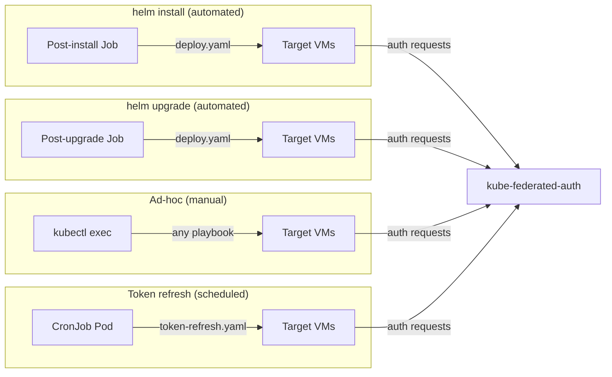

# Deployment Guide

## Overview

av-scanner runs as a systemd service on Ubuntu VMs. The Helm chart provides three mechanisms for managing deployments:

1. **Helm hooks** — automated Jobs that run on `helm install` and `helm upgrade` to deploy av-scanner to VMs without manual intervention.
2. **Controller pod** — an always-on pod for ad-hoc operations (re-deploy, troubleshooting, running playbooks manually).
3. **CronJob** — runs on a schedule (default: every 12h) to refresh SA tokens on VMs.



## Helm Chart

### Prerequisites

Create a Kubernetes secret containing the SSH private key for connecting to target VMs. The secret must have a key named `id_ed25519`:

```bash
kubectl create ns av-scanner
kubectl -n av-scanner create secret generic my-ssh-key --from-file=id_ed25519=<path>
```

### Install

```bash
helm install av-scanner oci://ghcr.io/null-ptr-exception/av-scanner/charts/av-scanner \
    -n av-scanner \
    --set sshKey.existingSecret=my-ssh-key
```

`sshKey.existingSecret` is required — the chart will fail to render without it.

See `charts/av-scanner/values.yaml` for all configurable values.

### What happens on install

1. **Pre-install hook** — validates SSH connectivity to all inventory hosts (`ansible all -m ping`)
2. **Post-install hook** — mints a fresh SA token, then runs the full deploy playbook

### What happens on upgrade

1. **Post-upgrade hook** — runs the deploy playbook (no new token minted; existing tokens are preserved)

## Controller Pod

The controller pod is an always-on Deployment for initial setup and ad-hoc operations. It is enabled by default (`controller.enabled: true`).

```bash
# Exec into the controller
kubectl -n av-scanner exec -it deploy/av-scanner-controller -- bash

# Full deploy (ClamAV + binary + config)
ansible-playbook playbooks/deploy.yaml

# Refresh tokens only
ansible-playbook playbooks/token-refresh.yaml

# Restart av-scanner on all VMs
ansible-playbook playbooks/restart.yaml
```

## Playbooks

| Playbook | Description |
|----------|-------------|
| `playbooks/deploy.yaml` | Full deploy: ClamAV + av-scanner binary + config |
| `playbooks/token-refresh.yaml` | Mint SA token + copy to VMs + rolling restart |
| `playbooks/restart.yaml` | Rolling restart of av-scanner service |

`restart.yaml` and `token-refresh.yaml` run with `serial: 1` (one VM at a time) and wait for the health check to pass before proceeding, ensuring zero-downtime when a load balancer is in front. `deploy.yaml` runs on all hosts in parallel by default (override with `deploy_serial` variable).

## CronJob

The CronJob runs `token-refresh.yaml` on a schedule (default: every 12h) to mint fresh SA tokens and distribute them to VMs.

The CronJob schedule must be shorter than `token.duration` (default: 168h) to ensure tokens are refreshed before expiry. With the default settings, up to 14 consecutive missed runs can be tolerated before tokens expire.

## Load balancing with Istio

The Helm chart can optionally create Istio resources (VirtualService, ServiceEntry, DestinationRule) to load-balance traffic across VMs through an existing Istio ingress gateway.

```yaml
istio:
  enabled: true
  gatewayRef: istio-system/av-scanner        # cross-namespace Gateway reference
  gatewayNamespace: istio-system             # for exportTo scoping
  virtualServiceHost: av-scanner.corp.example.com  # real external FQDN
  serviceEntryHost: av-scanner.internal      # internal routing identifier
  endpoints:
  - address: 192.168.122.178
  - address: 192.168.122.45
```

The Gateway resource itself must be deployed separately in the ingress gateway namespace. See [Load Balancing with Istio Gateway](load-balancing-with-istio.md) for the full design, resource placement, and traffic flow.

## Configuration

### Helm values

| Value | Default | Description |
|-------|---------|-------------|
| `image.registry` | ghcr.io | Image registry |
| `image.repository` | null-ptr-exception/av-scanner | Image repository |
| `image.tag` | (Chart.appVersion) | Image tag |
| `sshKey.existingSecret` | (required) | Secret containing `id_ed25519` key |
| `inventory` | (see values.yaml) | Ansible inventory YAML |
| `token.serviceAccount` | av-scanner | ServiceAccount to mint tokens for |
| `token.duration` | 168h | Token expiry duration |
| `controller.enabled` | true | Enable always-on controller pod |
| `cronjob.schedule` | `0 */12 * * *` | Token refresh CronJob schedule |
| `autoDeploy.enabled` | true | Enable post-install/upgrade hooks |
| `preInstallCheck.enabled` | true | Enable SSH validation pre-install hook |
| `istio.enabled` | false | Enable Istio load balancing resources |

### Ansible variables (inventory group_vars)

The av-scanner service on VMs is configured through Ansible variables set in the `inventory` value's `group_vars`. The Ansible role templates these into the systemd unit during deployment.

```yaml
inventory: |
  all:
    vars:
      ansible_ssh_private_key_file: /ssh/id_ed25519
      av_engine: clamav
      auth_enabled: true
      k8s_api_endpoint: "https://kube-federated-auth.example.com"
    hosts:
      vm1:
        ansible_host: 192.168.122.178
        ansible_user: ubuntu
```

#### General

| Variable | Default | Description |
|----------|---------|-------------|
| `av_engine` | clamav | Active engine (`clamav` / `trendmicro`) |
| `av_scanner_port` | 3000 | HTTP server port |
| `scan_dir` | /tmp/av-scanner | Upload/scan directory |
| `log_level` | info | Log level |

#### Engine-specific

| Variable | Default | Description |
|----------|---------|-------------|
| `clamav_rts_log_path` | /var/log/clamav/clamonacc.log | ClamAV real-time scan log |
| `tm_rts_log_path` | /var/log/ds_agent/ds_agent.log | TrendMicro DS Agent log |

#### Authentication

| Variable | Default | Description |
|----------|---------|-------------|
| `auth_enabled` | false | Enable SA token authentication |
| `k8s_api_endpoint` | (required if auth enabled) | URL of kube-federated-auth service |
| `auth_allowlist_file` | /etc/av-scanner/allowlist.yaml | Path to SA allowlist on VM |
| `k8s_auth_token_path` | /etc/av-scanner/sa-token | Path to SA token on VM |

## Service management

The scanner runs as a systemd service on the target VM:

```bash
sudo systemctl status av-scanner
sudo journalctl -u av-scanner -f
sudo systemctl restart av-scanner
```
